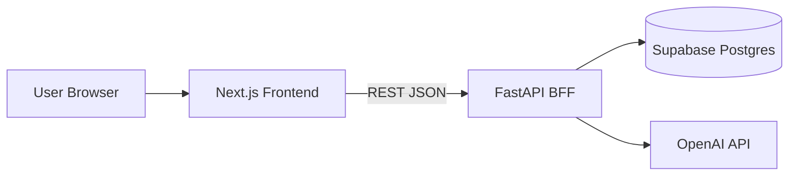

# MindMate Architecture

Dokumen ini menjelaskan arsitektur sistem MindMate secara keseluruhan, termasuk backend FastAPI yang sudah diimplementasikan.

Untuk detail per file backend, baca: **[BACKEND.md](./BACKEND.md)**

---

## Overview

MindMate adalah aplikasi web untuk pendampingan kesehatan mental:

- Chat dengan AI (respon empatik + deteksi emosi)
- Pelacakan mood harian
- Dashboard insight & rekomendasi

---

## Tech Stack

| Lapisan | Teknologi | Status |
|---------|-----------|--------|
| Frontend | Next.js (App Router) | UI lengkap |
| Backend | FastAPI (Python) | API + logika bisnis |
| Database | Supabase (PostgreSQL) | Direncanakan; dev pakai in-memory |
| AI | OpenAI / Anthropic | Direncanakan; dev pakai rule-based fallback |
| Deploy | Vercel + Render | Direncanakan |

---

## Architecture Pattern: Backend-for-Frontend (BFF)

Frontend **tidak** langsung ke Supabase atau OpenAI. Semua lewat FastAPI:

```
┌──────────────┐
│   Browser    │
│  (Next.js)   │
└──────┬───────┘
       │ HTTPS / JSON
       ▼
┌──────────────┐     ┌─────────────┐     ┌──────────────┐
│   FastAPI    │────►│  In-Memory  │     │   OpenAI     │
│   (BFF)      │     │  atau       │     │   (nanti)    │
│              │────►│  Supabase   │     └──────────────┘
└──────────────┘     └─────────────┘
```

**Alasan BFF:**

- Secret API key hanya di server
- Satu tempat validasi, rate limit, logging
- Frontend tetap sederhana (`lib/api.js`)

---

## Backend internal (lapisan)

```
HTTP Request
     │
     ▼
┌─────────┐   validasi    ┌──────────┐
│ Router  │──────────────►│  Schema  │  (Pydantic)
└────┬────┘               └──────────┘
     │
     ▼
┌─────────┐   bisnis      ┌──────────┐
│ Service │──────────────►│  Store   │  (RAM / DB)
└─────────┘               └──────────┘
     │
     ▼
 JSON Response
```

| Router | Service | Store |
|--------|---------|-------|
| `health.py` | — | — |
| `chat.py` | `chat_service.py` | chat messages |
| `mood.py` | — (langsung store) | mood entries |
| `insights.py` | `insights_service.py` | baca chat + mood |

---

## System Components

### 1. Frontend (Next.js)

- Halaman: `/`, `/chat`, `/mood`, `/dashboard`, `/login`
- `lib/api.js` — HTTP client ke backend
- Auth sementara: `localStorage` (`AuthContext`)
- Beberapa halaman masih mock data — wiring ke API = langkah berikutnya

### 2. Backend (FastAPI) — **sudah ada**

- Entry: `backend/app/main.py`
- Config: `backend/.env` (lihat `.env.example`)
- Endpoint prefix `/api/*` selaras frontend
- Mode dev: **in-memory store** (data hilang saat restart server)

### 3. Database (Supabase) — **rencana**

Tabel yang direncanakan:

| Tabel | Isi |
|-------|-----|
| `profiles` | Data user |
| `mood_entries` | Mood harian |
| `chat_messages` | Riwayat chat + emotion |

Klien sudah disiapkan di `services/supabase_client.py`, belum dipakai router.

### 4. AI Service — **rencana**

- Saat ini: keyword emotion + template balasan (`chat_service.py`)
- Nanti: `OPENAI_API_KEY` → `generate_reply()` panggil Chat Completions API

---

## Data Flow: Chat

```
1. User ketik pesan di /chat
2. Frontend POST /api/chat { message, user_id }
3. FastAPI validasi ChatRequest
4. chat_service.process_chat():
   a. detect_emotion(message)
   b. simpan pesan user ke store
   c. generate_reply()
   d. simpan balasan assistant + emotion + stress_level
5. Response JSON → tampil di UI
```

## Data Flow: Mood

```
1. User pilih mood di /mood
2. Frontend POST /api/mood { user_id, mood, note }
3. store.upsert_mood() — satu entri per tanggal
4. GET /api/mood/stats & /api/insights/* untuk dashboard
```

---

## Environment & Security

| Secret | Lokasi | Catatan |
|--------|--------|---------|
| `OPENAI_API_KEY` | `backend/.env` | Hanya server |
| `SUPABASE_SERVICE_ROLE_KEY` | `backend/.env` | Hanya server |
| `NEXT_PUBLIC_API_URL` | `frontend/.env.local` | Bukan rahasia |

Jangan commit `.env` — sudah di `.gitignore`.

CORS: backend mengizinkan origin frontend (`CORS_ORIGINS`).

---

## Deployment (rencana)

```
Vercel          →  Next.js frontend
Render/Railway  →  FastAPI (Dockerfile di backend/)
Supabase Cloud  →  PostgreSQL
```

`docker-compose.yml` di root untuk develop lokal (frontend + backend).

---

## Diagram lengkap (target produksi)



**State saat ini:** garis `API → DB` dan `API → AI` belum aktif; `API` pakai in-memory + rule-based chat.

---

## Dokumentasi terkait

- [BACKEND.md](./BACKEND.md) — penjelasan mendalam tiap file backend
- [api-docs.md](./api-docs.md) — referensi endpoint
- [CARA_MENJALANKAN.md](./CARA_MENJALANKAN.md) — cara run project
